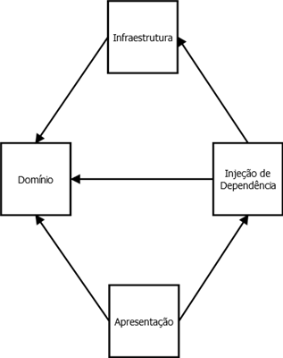

# DDD

Em nossos projetos, quando adequado, procuramos seguir o [DDD](https://en.wikipedia.org/wiki/Domain-driven_design)
(*Domain Driven Development* ou *Domain Driven Design*).

## Se fizer sentido

DDD *casa* muito bem com nossos projetos, em especial projetos que são web e que a complexidade está nas regras de
negócio (e não nos requisitos técnicos), mas ele não é uma regra.
Fique à vontade para adotar outra arquitetura para o projeto se ela fizer sentido.

Também não procuramos dar um sentido estrito de como implementar o DDD (agregados, objetos de valor, serviços, etc),
fica a cargo de cada projeto decidir esses pormenores arquiteturais, prezamos pela divisão correta das camadas/projetos
e por um código que seja consistente no que decidiu padronizar.

## As camadas e suas responsabilidades

Criamos as entidades na camada de **Domínio**, é lá que as regras de negócio de nossas aplicações residem.

Procuramos não implementar qualquer trabalho que não seja de fato relacionado as regras de negócio no domínio (como
enviar um email ou acessar o banco de dados), ele apenas expõe uma série de interfaces que irão ser
implementadas em outra camada.

A camada de **Infraestrutura** implementa as interfaces expostas pelo domínio mencionadas acima.

A camada de **Injeção de dependência** oferece um resolvedor de dependência para o domínio.
O domínio pede a esse resolvedor uma implementação de uma dada interface e ele "resolve" para uma implementação
concreta, realizando a chamada [Inversão de Controle](https://en.wikipedia.org/wiki/Inversion_of_control).

A **Apresentação** é a camada que "executa" o projeto em si (geralmente web ou desktop).
Ela, assim que inicia, injeta o resolvedor de dependência no domínio.
Durante seu funcionamento ela vai repassando as ações e dados fornecidos ao usuário para o domínio e vice-versa.

## Os projetos

* O Domínio não referencia ("enxerga") nenhum outro projeto.
* A Infraestrutura referencia o Domínio pois é dele que vêm as interfaces a serem implementadas.
* A Injeção de Dependência referencia o Domínio e a Infraestrutura pois em seu resolvedor fica mapeado qual interface
(do Domínio) é resolvida para qual implementação (da Infraestrutura).
* A Apresentação referencia a Injeção de Dependência e o Domínio pois ela irá injetar (*setar* em uma propriedade
estática) o resolvedor ao Domínio, além de manipular o Domínio conforme as ações do usuário vão sendo realizadas.

## Exemplo

A pasta [Exemplo](Exemplo) contém um projeto simples e didático que mostra essa arquitetura em funcionamento.