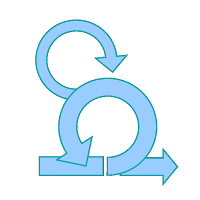
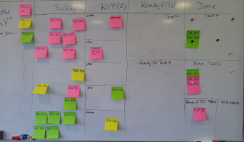
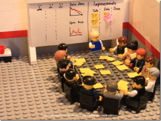
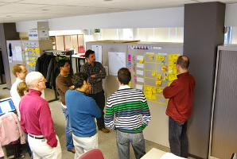
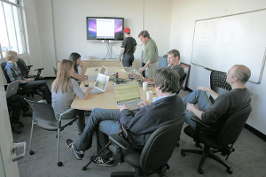

# Desenvolvimento Ágil

O objetivo deste documento é formalizar o processo ágil adotado por alguns projetos da AeC.
Fica aberto para devidas alterações e adaptações, tanto no documento como na utilização em algum projeto específico.
Nosso processo é adaptação do [Scrum](https://scrumalliance.org/why-scrum).

Este é apenas um guia do nosso processo ágil, um referencial.
Ele não substitui eventuais treinamentos ou a experiência adquirida conforme o processo for sendo utilizado.

**Sumário**

* [Papéis](#papéis)
* [A Sprint](#a-sprint)
* [Product Backlog](#product-backlog)
* [Sprint Backlog](#sprint-backlog)
* [Scrum Board](#scrum-board)
* [Sprint Planning](#sprint-planning)
* [Daily Meeting](#daily-meeting)
* [Sprint Review](#sprint-review)
* [Sprint Retrospective](#sprint-retrospective)
* [Outros Conceitos](#outros-conceitos)
* [Créditos](#créditos)

## Papéis

Os envolvidos no processo são: o *Cliente*, o *Analista* e o *Time*.

O Analista é responsável por entender o negócio junto ao cliente e dividir a visão do produto com o Time.

O Time é responsável por desenvolver o produto, analisar e levantar eventuais riscos de caráter técnico. O Time é composto de todos envolvidos necessários para gerar um incremento: Desenvolvedores, Analista de Banco de Dados, Arquiteto, Designer, Tester e Analista de B.I.

Mais sobre as atribuições do Analista e do Time é demonstrado nos demais itens do documento.

## A Sprint

Passamos a medir nosso tempo de desenvolvimento do produto não mais em semanas ou meses, e sim em Sprints.
A Sprint representa uma iteração do desenvolvimento do produto, é durante ela que é desenvolvido o incremento (concluído, mas não necessariamente publicado).

A duração da Sprint é determinada pelos envolvidos considerando fatores como tempo de risco para o negócio, experiência da equipe e porte do software.
Recomenda-se utilizar Sprints de 1 a 4 semanas, sendo o mais comum Sprints de 2 semanas.

Se visto que a escolha do tempo foi inadequada pode-se alterar o tempo de Sprint, acordando com todos envolvidos, ao longo do projeto.
Mas não se prolonga ou encurta uma Sprint em andamento de maneira alguma (independente de como ela está).

A Sprint se inicia com as reuniões de Sprint Planning (parte 1 e parte 2).
Após a reunião de planning inicia-se o desenvolvimento do produto, havendo em cada dia de trabalho uma Daily Meeting.
Logo ao final da Sprint ela é encerrada pelas reuniões de Sprint Review e Sprint Retrospective.

O término de uma Sprint significa o inicio de outra logo em seguida.
Deve-se evitar ao máximo criar intervalo entre Sprints.

## Product Backlog

O Product Backlog é uma lista ordenada de tudo o que é necessário e desejável no produto. Seu conteúdo é dinâmico, ele deve mudar conforme o produto é desenvolvido e mais do negócio é conhecido.
Funcionalidades incertas ou não essenciais devem também estar expressas no backlog: o Product Backlog representa a visão que se tem do produto.
Ele muda independentemente do desenrolar das sprints.

A lista é ordenada conforme a prioridade de cada item.
Quanto mais acima na lista estiver um item mais cedo ele será produzido.
Os itens da parte de cima do backlog são bem conhecidos e descritos enquanto os mais abaixo nem tanto.

Recomenda-se utilizar *estórias de usuário* como itens dessa lista.
Estórias de usuário são pequenas frases que demonstram o que um usuário do produto faz ou necessita.
Um formato muito comum é:

> Como [papel do usuário] eu gostaria de [objetivo / necessidade].

Pode se criar o template com o que for mais adequado ao projeto.
Normalmente pergunta-se: Quem, Quando, Onde, O quê e/ou Por que.

Junto à estória de usuário deve existir uma especificação ou descrição.
Apenas a frase é insuficiente para o entendimento do que deve ser feito.

O Product Backlog é alterado somente pelo Analista, mas é visível por todos envolvidos (Time e Cliente).
Deve-se estimular o contato frequente com o Product Backlog, a fim de obter feedback e prever riscos.

## Sprint Backlog

O Sprint Backlog é uma lista ordenada de estórias selecionadas para a Sprint e suas respectivas atividades.
Ele representa as atividades do Time na Sprint agrupadas por suas respectivas estórias.
Assim como Product Backlog, o Sprint Backlog é ordenado conforme a prioridade de suas atividades e estórias.

O Sprint Backlog é alterado somente pelo time, mas é visível também para Analista.

## Scrum Board

Uma das práticas que encorajamos é utilizar um quadro (chamado de *Scrum Board*) para organizar o trabalho da sprint.
Ele basicamente representa o Sprint Backlog, suas atividades e estórias, com colunas representando o status da atividade (terminando em concluído).
Pode se utilizar o quadro também para colocar qualquer outra informação relevante a Sprint (como pendências, impedimentos e datas).

É desejável que o quadro seja um quadro físico, dando facilitando a visibilidade a todos e a manipulação pelo Time.

## Sprint Planning

A Sprint Planning é a reunião que inaugura a Sprint.
Ela é divida em duas partes: na primeira parte (*planning 1*) discute-se **o que** será feito na Sprint, na segunda parte (*planning 2*) **como** será feito.
Durante essa reunião é formado o Sprint Backlog.

Na primeira parte da reunião o Analista apresenta para o Time as estórias do Product Backlog que serão produzidas durante a Sprint.
À medida que o Analista vai mostrando as estórias o Time aproveita para tirar todo tipo de dúvida sobre a estória com o Analista.
Quando o time percebe que a quantidade de estórias apresentadas é suficiente para preencher uma sprint segue-se para a segunda parte da reunião.

Na segunda parte da reunião, não mais com o Analista presente, o Time divide as estórias selecionadas para Sprint em atividades menores.
É nessa reunião que dúvidas de cunho técnico são discutidas e o software é arquitetado.
Após a reunião o Sprint Backlog deve estar completo.

Terminada a Sprint Planning o Time atualiza o Scrum Board com o Sprint Backlog da Sprint atual e inicia-se o desenvolvimento.

## Daily Meeting

Durante os dias de trabalho da Sprint o Time se reúne rapidamente em uma reunião diária para sincronizar o trabalho.
Ela deve ser curta (15 minutos), e, para assegurar que ela seja sucinta, todos ficam de pé e a reunião acontece sempre no mesmo local no mesmo horário.

Essa reunião diária, chamada de Daily Meeting (ou somente *daily*) deve ser curta e não deve ser utilizada para obter feedback ou tirar dúvidas maiores.
Nela, geralmente, cada membro do time responde de forma sucinta:

* O que fez desde a última reunião;
* O que pretende fazer até a próxima;
* Quais impedimentos está tendo.

Esta é uma reunião do Time para o Time.
O Analista pode estar presente, mas deve se resumir a mero espectador.

## Sprint Review

Essa reunião acontece ao final da Sprint.
É o momento de Analista, Time e Cliente inspecionarem o que foi feito na Sprint.
O Time mostra para Cliente e Analista o que foi feito na Sprint.

É importante que seja exibido o real software em funcionamento, e não um protótipo ou algo parecido (mesmo que não haja entrega envolvida na Sprint).

Outro ponto importante é que essa reunião não é uma mera demonstração, é um momento de obter feedback sobre o que foi feito.
Essa reunião geralmente produz mudanças no Product Backlog.

Apesar de muitas vezes não ser possível, é extremamente importante a presença do Cliente nessa reunião, sincronizando o entendimento e acompanhamento do Cliente com Analista e Time além de fornecendo feedback.

## Sprint Retrospective

Logo após a reunião de Sprint Review, encerrando finalmente a Sprint, acontece a reunião de Sprint Retrospective.
Nessa reunião Analista e Time inspecionam e discutem as pessoas, as relações, o processo e as ferramentas.
Essa reunião é dedicada para discutir como vem sendo feito o trabalho, e não sobre o produto em si.

Identificar o que foi bom, ruim e o que precisa melhorar é o que normalmente se faz nessa reunião.
Além disso, é importante que dela já surja algum eventual plano de melhora (e não apenas identificar a necessidade).

Como forma de guiar a retrospective, uma recomendação é levantar com todos *O que foi bom?* e *O que foi ruim?* na sprint.
É importante que os pontos levantados sejam anotados para serem discutidos durante a próxima retrospective.

Outro ponto importante a ser levantado aqui são os impedimentos que houveram na sprint.
A partir deles podemos notar se esses impedimentos são recorrentes ou eventuais e planejar como lidar com eles.

## Outros Conceitos

Abaixo vão alguns tópicos que podem futuramente ser incorporados ou citados em nosso processo:

* Definição de Pronto (*Definition of Done*)
* *Planning Poker* e *Story Points*
* Falar especificamente sobre os papéis do Time
* Falar sobre a equipe de Processos
* Objetivo da Sprint (*Sprint Goal*)
* Sprint 0 (zero)
* O que fazer com o que não foi concluído na Sprint?
* O que fazer as atividades da Sprint forem concluídas antes do final da Sprint?
* Cancelamento de uma Sprint
* Duração das reuniões
* Refinamento de Backlog
* *Release Planning*
* *Burndown Chart*
* Ferramenta utilizada para gerir o Product Backlog
* Número/nome da Sprint

## Créditos

Crédito das imagens:

* [Desenvolvimento Ágil](http://curia.europa.eu/juris/document/document.jsf?docid=73361)
* [A Sprint](http://commons.wikimedia.org/wiki/File:Scrum_process.svg)
* [Product Backlog](http://languageboat.com/2014/07/21/wish-list-languages-i-would-like-to-learn)
* [Sprint Backlog](http://promoline.com.br/blog/index.php/post-it-personalizado)
* [Scrum Board](https://cigaminfra.wordpress.com/2009/11/23/sprint-04-segunda-feira)
* [Sprint Planning](https://hakanforss.wordpress.com/2012/04/25/agile-lego-toyota-kata-an-alternative-to-retrospectives)
* [Daily Meeting](http://razortheory.com/scrum)
* [Sprint Review](http://commons.wikimedia.org/wiki/File:Revision_3%27s_Friday_afternoon_staff_meeting.jpg)
* [Sprint Retrospective](https://redperil.wordpress.com/2011/01/02/new-year-resolutions)
* [Outros Conceitos](http://icongal.com/gallery/icon/24757/128/plus_sketchy_add)