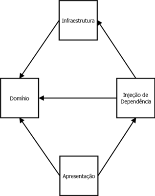

# Email Service

Web service de envio de email.

Tal web service existe para evitar que os diversos sistemas da empresa acessem diretamente o servidor SMTP dando uma
flexibilidade no seu gerenciamento (por exemplo, ao trocarmos o servidor SMTP não precisamos trocar a configuração de
todos os sistemas, apenas deste web service).

Além disso o web service permite também, no futuro, adicionarmos funcionalidades com estatísticas de uso ou templates
personalizados.

## Arquitetura - Camadas

O centro da aplicação é a camada de **Domínio** que expõe uma série de interfaces para implementações que independem de
regra de negócio.

A camada de **Infraestrutura** implementa tais interfaces e a camada de **Injeção de Dependência** mapeia qual
implementação é utilizada para qual interface.

Finalmente, a camada de **Apresentação**, que é o projeto web em si, injeta o resolvedor de dependência no domínio e
dispara ações no domínio conforme as requisições forem acontecendo.



Essa arquitetura que desenvolve todo o projeto em torno de uma camada de domínio isolada e bem definida e comumente
conhecida como [DDD](https://en.wikipedia.org/wiki/Domain-driven_design).

## Arquitetura - Funcionamento

O web service simplesmente recebe o email de um sistema e envia-o para o servidor SMTP da AeC.
Na página raiz do próprio web service constam as instruções de como utilizá-lo (como realizar a requisição).

A única "sofisticação" provida pelo web service é a resolução de nomes do Active Directory (pode se utilizar o nome
cadastrado na rede ao invés do endereço de email).
O envio em si é bem simples, não existe fila ou algo do tipo (hoje o envio é síncrono e não há persistência).

Ao executa o web service localmente utilizar o [Papercut] como servidor SMTP local.

[Papercut]: https://papercut.codeplex.com

## Configuração

A única configuração necessária é a configuração do servidor `<smtp>` no arquivo Web.config.
Basta configurá-la conforme [sua documentação](https://msdn.microsoft.com/library/ms164240).

Exemplo:

```
<system.net>
  <mailSettings>
    <smtp deliveryMethod="Network">
      <network host="servidor_123" userName="usuario@empresa.com" password="luckyGhos+41" port="25" />
    </smtp>
  </mailSettings>
</system.net>
```

## Documentos

Por ser um serviço simples, não foi confeccionada uma especificação funcional, apenas esta (que é técnica).

## Integrações

Além de o sistema ser um próprio web service, a única integração existente é com o servidor SMTP para o real envio do
email.

## Publicação

Basta, após fechar uma nova versão, gerar uma publicação no Visual Studio e repassá-la a equipe de gestão de
configuração.
A configuração do servidor SMTP no Web.config fica a cargo deles (deixe-a em branco).