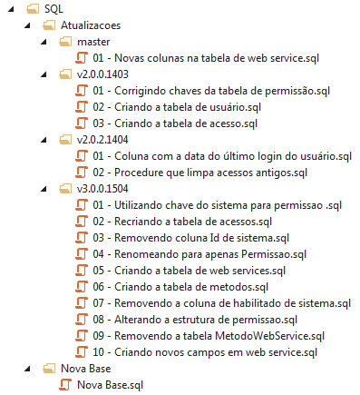

# Versionando o banco de dados

Assim como o código, o banco de dados do sistema também há de ser versionado.

Utiliza-se o mesmo número de versão do código, ou seja, as versões de código e banco caminham juntas.

Ou melhor, não existe distinção entre *versão de código* e *versão de banco*.
Existe somente a *versão do software*.

## Os scripts

Existem dois tipos de scripts, os de *nova base* e de *atualizações*.

**Nova base**

Para uma nova base mantém-se apenas um script; script este que cria a estrutura (*schema*) do banco e faz carga inicial nas tabelas necessárias.

Esse script é utilizado ao criar um novo ambiente (limpo).

É mantida apenas uma versão deste script, em vista que (na grande maioria dos casos) a instalação de um novo ambiente é feita com a última versão do software.

**Atualizações**

Para atualizações são mantidos os scripts dentro de uma pasta com o exato número da versão.
Pode-se utilizar apenas um script para versão ou vários (se for uma atualização grande procure dividir os scripts).

Lembre-se de, ao utilizar vários scripts para atualização de uma versão, mantê-los ordenados (inicie o nome do script com um número indicando sua ordem).

## Estrutura de pastas

Crie uma pasta `SQL` dentro do projeto de persistência de sua solução.

Crie uma pasta `SQL/Atualizacoes`.
Nesta pasta:

* Para versões com apenas um script, crie um script cujo nome é o nome de versão `v1.1.3.1502.sql` por exemplo.
* Para versões com *n* scripts, crie uma pasta com o número da versão (`v1.2.0.1504` por exemplo):
 * Dentro desta pasta crie os scripts de atualização da versão (`01 - alterando tabela ABC.sql`, `02 - removendo relacionamento XYZ.sql` por exemplo).

## E as alterações que ainda estão em desenvolvimento? (não possuem versão)

Para estas, utilize o nome do branch em que está trabalhando no lugar do número de versão (lembre-se que `master` é um branch).

Ao fechar a versão de tal atualização, renomeie a pasta/arquivo com nome do branch para o número de versão gerado.

## *Uma imagem vale mais que mil palavras*

Segue um exemplo (real):

## Lembre-se

* Não se esqueça de que ao alterar o banco não basta criar um novo script de atualização, há de se alterar também o de nova base!
* Se estiver trabalhando com mais de uma pessoa, combine com esta a numeração dos scripts a fim de evitar números repetidos (para atualizações com mais de um script).
* As edições feitas nos arquivos e pastas que estão dentro da solução do Visual Studio não são adicionadas automaticamente ao arquivo `.csproj` (um *build* força esse salvamento). 
